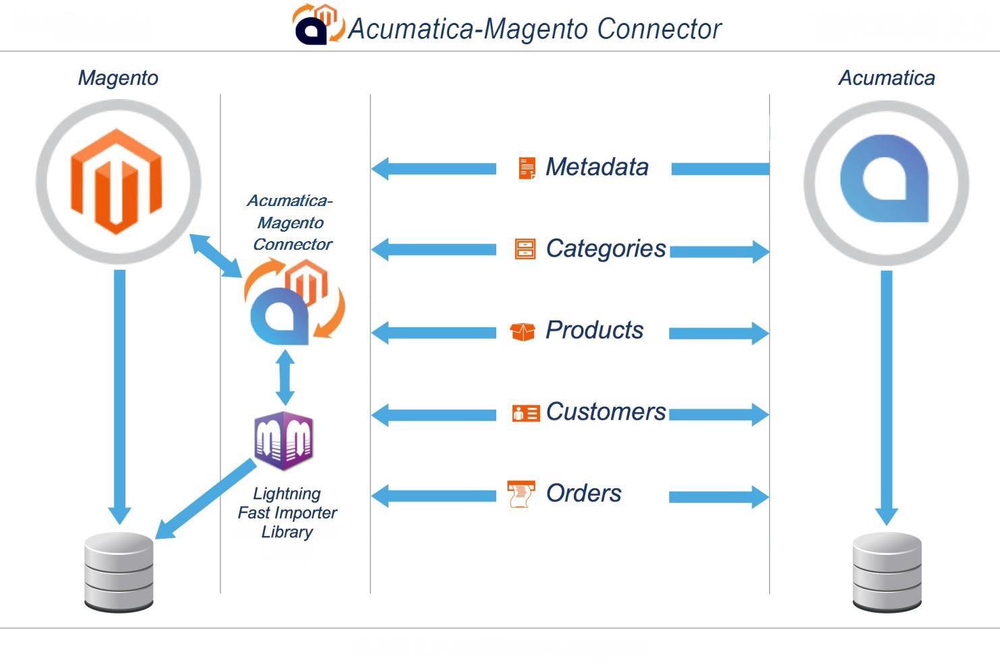

### 1.1 Introduction

Thank you for purchasing the Acumatica eCommerce Edition® for your Business. This document will
help you to configure the settings and guide you to use the key features of Acumatica-Magento Connector.

### 1.2 Dataflow

